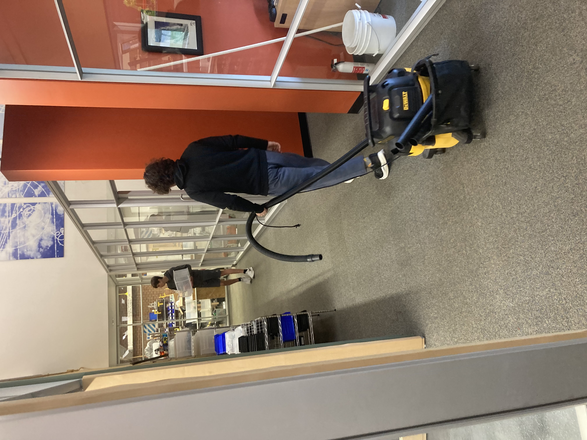

# Pi-in-the-Sky
The "Flying Fish"

## Assignment Description

We want to fire a projectile out of Mr. Miller's air cannon that can withold up to 100 psi of pressure. We want our payload to achieve the greatest possible velocity upon launch.

# Planning

## Initial Research
While researching we've learned to make sure that the center of pressure of our "mortar" needs to be behind the center of mass.

We will find the equation for velocity over time V(T) and plot it on a Velocity/Time graph. Then we will use both derivative tests to find the maximum/minimum points as well as points of concavity. 

## Initial Brainstorming
We've decided to use the teardrop shape for the main body as it is the most aerodynamic. Also, we are going to add fins to stabilize so it doesnt flip and tumble in the air.

## Initial Designing

-inside diameter of largest part of the rocket is 65.43mm 

## Materials used

-Multiple re-prints using PLA for rocket structure
-Foam used to cushion parts inside the rocket (Pico, Accelerometer, GPS module, Powerboost, Battery, and Switch)
-Copper BBs used initially in head of rocket to weigh down, later water-cut a ring of railroad metal to provide more weight

## Code

## Air cannon

Middle opening in the larger pvc pipe is 3.042 inches, smaller pvc pipe is 2.047 inches. 

## Risk Mitigation

We will wear proper PPE during all test and final launches as well as keep the projectile safe betweeen launches. Before firing at 100 psi we will do test launches starting from as low as 20 psi. We will also do our best to not fire at homes.

## Data

Spring is 87.5mm by 21.5mm. Inside of spring's diameter is 17mm.
Inside holes for where circuit board screws go are 2.8mm

Diameter for inside of screw holes for circuit board are 2.8mm
# Timeline (10 weeks)

## First 2 weeks

Onshape design + CFD 

## Next 3 weeks

Learning + Creating ciruit board

Circuit board itself is 109.3mm by 54mm without modules
Circuit board with modules is 120.5mm by 54.1mm

## Next 2 weeks 

Coding/Testing

[GPS Module](rapsberry/gpsmodule.py)

[Accelerometer](rapsberry/accelerometer.py)

## Last 3 weeks 

Trials/Tribulations

Now found out we need a button or switch to change the pico from a Data collecting mode to a Data saving mode

always have forceps or needle nose pliers on hand if you are changing something to the circuit board while its in the payload bay because your fat fingers are not fitting that far into the bay.

# Launch day 4/17

Immediately tumbled, landed on its side but did not shatter on outside. Inside however had multiple broken parts. Need to add more weight in tip compartment to prevent further tumble.

Filled tip and head of the rocket with copper bbs for more weight support.

## Post launch days

Printed new mid section for rocket with more supports. Also changed the wire inside to a switch so we could easily change between data or code mode. 

## Rest of time

Collect data, rework designs with onshape and physical creations, launch again

# 4/24
Added aceleration to be printed out with the other date. Fixed multiple small erros involving small mistakes such as missing colons and writing things the wrong way. Added exstensive padding to the inside of the projectile in order to protect the gps module and powerboost. 

# 5/1
We figured out from looking at mortar launchers that a higher launch angle will benefit what we are looking for. We dont want a lot of distance in our firing, we are trying to find maximum velocity. We also added a better switch in order to switch between data mode and boot mode a lot easier than before. also a small note make sure to hold down the launch button when firing in order to get the most air released as possible.

# 5/8
Further added a default value of acceleration to be 0 in the code. Fixed locations (tabbing) of lines of code to work properly.

# 5/15
This week was focusing on fixing the weight distribution. Even with the added weight inside the upper body the projectile was still tumbling when shot. Instead of doddling around with those stupid copper shots and hot glue we decided to just cut a ring out of half inch rail road tie using the waterject. The new eight of the projectile was almost 500 grams. We attached it to the inside of the upper body with hot glue and, with all of the other weight that we added, we managed to move the center of mass up about a good inch-inch and a half. The gps module keeps coming out with every launch because its stupid and I hate it and it doesnt want to stay in the damn header and no matter what we put around it it manages to plop out because it is stubborn.

# 5/22
lastest launch test ended in complete seperation of the threading between the top and the body. We believe due to the added weight from the iron ring the spring bottomed out and put all the force of the landing into that one small point. We could possibly get a stronger spring as well as reinforce the bottom of the spring in case of another bottom out. The projectile also keeps tumbling, however, the air cannon seems to be moving as is fire and that could be a possible factor but we do need to fix the weight distribution as it has changed with the added weight.

^Data showm roughly the projectile changing in position. GPS module is not very accurate for small distances covered.

# 5/30
Graham cleans up pretzel crumbs

